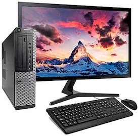
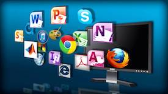
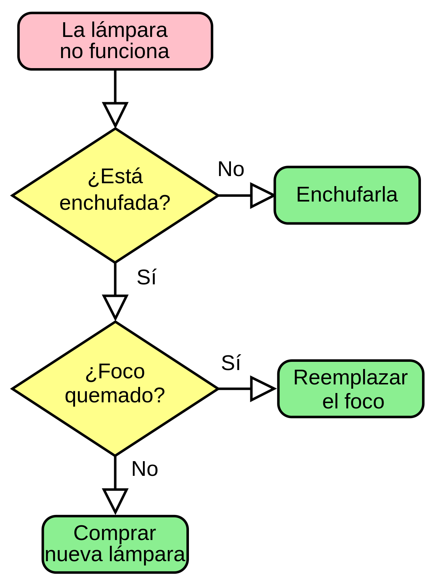

# Software 

A Real Academia Galega define a informática como a *"Ciencia do tratamento automático da información por medio de máquinas electrónicas"*. Este tratamento necesita de:
- **Soporte físico ou hardware** formado por todos os compoñentes electrónicos tanxibles involucrados no tratamento. 

- **Soporte lóxico ou software** que fai que o hardware funcione e está formado por todos os compoñentes intanxibles involucrados no tratamento: programas, datos e
documentación. 

- **Equipamento humano ou persoal informático** que manexa o equipamento físico e o lóxico para que todo o tratamento se leve a cabo.

## Algoritmo 

O concepto de programa informático está moi ligado ao concepto de algoritmo. Un **algoritmo** é un conxunto de instrucións ou regras ben definidas ordenadas y finitas que permite resolver un problema.

 Exemplo de algoritmo representado mediante un diagrama de fluxo:

 

O algoritmo pode escribirse nunha linguaxe de programación utilizando algunha ferramenta de edición, dando lugar a un programa que pode executarse polo ordenador, despois de sufrir algunhas modificacións. 

Os **programas informáticos** son imprescindibles para que os ordenadores funcionen e son conxuntos de instrucións que unha vez executadas realizarán unha ou varias tarefas. O **software** é un conxunto de programas e neste concepto inclúense tamén os datos que se manexan e a documentación deses programas.

