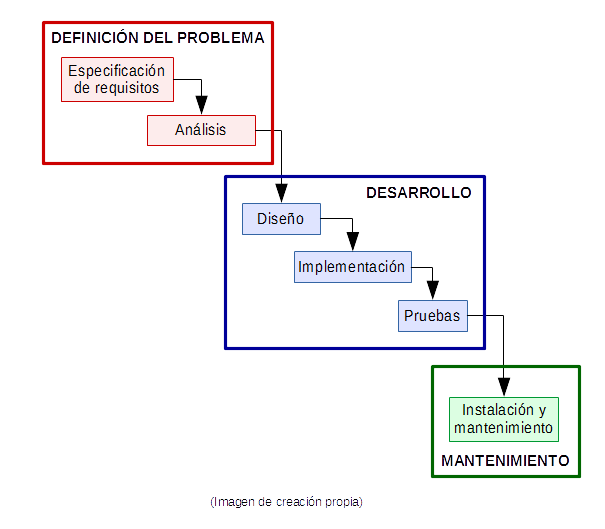
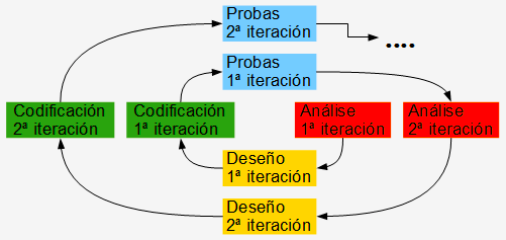

# Índice

- [Índice](#índice)
- [Ciclo de Vida](#ciclo-de-vida)
  - [Paradigma de vida clásico ou modelo en cascada](#paradigma-de-vida-clásico-ou-modelo-en-cascada)
    - [Análise](#análise)
    - [Deseño](#deseño)
    - [Codificación](#codificación)
    - [Probas](#probas)
  - [Modelo en espiral](#modelo-en-espiral)

# Ciclo de Vida

O proceso de desenvolvemento de software é moi diferente dependendo da complexidade do software. 
Durante décadas os enxeñeiros e enxeñeiras de software foron desenvolvendo e mellorando paradigmas (métodos, ferramentas e procedementos para describir un modelo). 

[Ingeniería del software. Metodologías y ciclo de vida](https://www.academia.edu/13713066/Guia_de_ingenieria_del_software)

## Paradigma de vida clásico ou modelo en cascada

O paradigma de ciclo de vida clásico do software, tamén chamado modelo en cascada consta das fases: análise, deseño, codificación, probas, instalación e mantemento e a documentación é un aspecto implícito en todas as fases. Algúns autores nomean estas fases con nomes lixeiramente diferentes, ou poden agrupar algunhas para crear unha nova fase ou nomear unha fase con máis detalle, pero en esencia as fases son as mesmas.
Algunhas destas fases tamén se utilizan noutros modelos con lixeiras variantes.
As fases vanse realizando de forma secuencial utilizando a información obtida ao finalizar unha fase para empezar a fase seguinte. Deste xeito o cliente non pode ver o software funcionando ata as últimas fases e daría moito traballo corrixir un erro que se detecta nas últimas fases pero que afecta ás primeiras.

### Análise 

Nesta fase o analista captura, analiza e especifica os requisitos que debe cumprir o software. Debe obter a información do cliente ou dos usuarios do software mediante entrevistas planificadas e habilmente estruturadas nunha linguaxe comprensible para o
usuario. O resultado desta captura de información depende basicamente da habilidade e experiencia do analista aínda que poida utilizar guías ou software específico.
Ao finalizar esta fase debe existir o documento de especificación de requisitos do software (ERS), no que estarán detallados os requisitos que ten que cumprir o software, debe valorarse o custo do proxecto e planificarse a duración do mesmo. Toda esta
información ten que comunicarse ao cliente para a súa aceptación.
A linguaxe utilizada para describir os ERP pode ser descritiva ou máis formal e rigorosa utilizando casos de usos na linguaxe de modelado UML. 

### Deseño 

Nesta fase o deseñador deberá de descompoñer e organizar todo o sistema software en partes que podan elaborarse por separado para así aproveitar as vantaxes do
desenvolvemento de software en equipo.
O resultado desta fase plásmase no documento de deseño de software (SDD) que contén a estrutura global do sistema, a especificación do que debe facer cada unha das
partes e a maneira de combinarse entre elas e é a guía que os programadores e probadores de software deberán ler, entender e seguir. Este documento incluirá o deseño lóxico de datos, o deseño da arquitectura e estrutura, o deseño dos procedementos, a organización do código fonte e a compilación, e o da interface entre o home e o software. 
Exemplos de diagramas que indican como se construirá o software poden ser: modelo E/R para os datos, diagramas UML de clases, diagramas UML de despregue e diagramas UML de secuencia.
Nesta fase debe tratarase a seguridade do proxecto mediante unha análise de riscos (recompilación de recursos que deben ser protexidos, identificación de actores e roles posibles, recompilación de requisitos legais e de negocio como encriptacións ou certificacións a cumprir, etcétera) e a relación de actividades que mitigan eses riscos.

### Codificación 

Esta fase tamén se chama fase de programación ou implementación. Nela o programador transforma o deseño lóxico da fase anterior a código na linguaxe de programación elixida, de tal forma que os programas resultantes cumpran os requisitos da análise e poidan ser
executado nunha máquina.
Mentres dura esta fase, poden realizarse tarefas de depuración do código ou revisión inicial do mesmo para detectar erros sintácticos, semánticos e de lóxica.

### Probas 

Esta fase permite aplicar métodos ou técnicas ao código para determinar que tódalas sentencias foron probadas e funcionan correctamente.
As probas teñen que planificarse, deseñarse, executarse e avaliar os resultados.
Considérase que unha proba é boa se detecta erros non detectados anteriormente. As probas realizadas inmediatamente despois da codificación poden ser:
- **Probas unitarias** cando permiten realizar tests a anacos pequenos de código cunha funcionalidade específica.

- **Probas de integración** cando permiten realizar tests a un grupo de anacos de código que superaron con éxito os correspondentes tests unitarios e que interactúan entre eles.
  
Outras probas sobre o sistema total poden ser:
- **Probas de validación ou aceptación** para comprobar que o sistema cumpre os requisitos do software especificados no ERS.
- **Probas de recuperación** para comprobar como reacciona o sistema fronte a un fallo
xeral e como se recupera do mesmo.
- **Probas de seguridade** para comprobar que os datos están protexidos fronte a agresións externas.
- **Probas de resistencia** para comprobar como responde o sistema a intentos de bloqueo ou colapso.
- **Probas de rendemento** para someter ao sistema a demandas do usuario extremas e comprobar o tempo de resposta do sistema.

As probas deberán de ser realizadas en primeiro lugar polos creadores do software pero é recomendable que tamén sexan realizadas por especialistas que non participaron na
creación e finalmente sexan realizadas por usuarios.

O software pode poñerse a disposición dos usuarios cando aínda no está acabado e entón noméase co nome comercial e un texto que indica o nivel de acabado. Ese texto
pode ser:
- **Versión Alfa.** Versión inestable, á que aínda se lle poden engadir novas características.
- **Versión Beta.** Versión inestable á que non se lle van a engadir novas características
pero que pode ter erros.
- **Versión RC (Release Candidate)** é case a versión final pero aínda poden aparecer erros.
- **Versión RTM (Release To Manufacturing).** Versión estable para comercializar.

## Modelo en espiral

Este modelo baséase na creación dun prototipo do proxecto que se vai perfeccionando en sucesivas iteracións a medida que se engaden novos requisitos, pasando en cada iteración polo proceso de análise, deseño, codificación e probas descritos no modelo en cascada. Ao final de cada iteración o equipo que desenvolve o software e o cliente analizaran o prototipo conseguido e acordarán se inician unha nova iteración. Sempre se traballa sobre un prototipo polo que no momento que se decida non realizar novas iteracións e acabar o produto, haberá que refinar o prototipo para conseguir a versión final acabada, estable e robusta.

